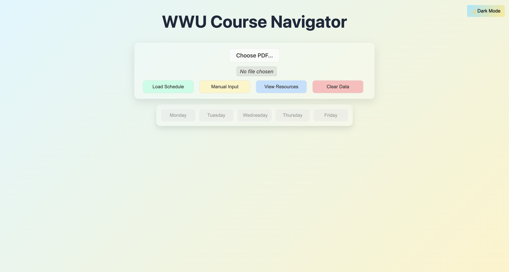

# WWU Course Navigator

**WWU Course Navigator** — a web app to help Western Washington University students explore, search, and plan courses.

---

## Table of Contents

- [About](#about)  
- [Features](#features)  
- [Tech Stack](#tech-stack)  
- [Getting Started](#getting-started)  
- [Deployment](#deployment)
- [Notes on Data Usage](#notes-on-data-usage)  
- [Project Structure](#project-structure)  
- [License](#license)  

---

## About

WWU Course Navigator helps students locate their classrooms and office hours across campus. The app allows students to enter information about their courses and instructors to receive guidance on classroom locations and office hour locations. Both the frontend and backend are hosted on Render, with the backend managing and serving dynamic location data.

> ⚠️ **Browser Recommendation:**  
> For the best experience, use **Google Chrome**. Other browsers may have limited PDF support or layout issues.

Below is the main interface of **WWU Class Map Visualizer**:



### Button & Feature Descriptions

1. **Choose PDF...**  
   - Allows the user to upload a **schedule PDF** from WWU.  
   - The app reads the PDF to extract class times and locations.

2. **Load Schedule**  
   - Processes the selected PDF or previously uploaded data.  
   - Maps the classes onto the WWU floorplans automatically.
   - Enables day buttons and displays course information.

3. **Manual Input**  
   - Enter class information manually if a PDF isn’t available.  
   - Useful for custom schedules or non-standard course formats.

4. **View Resources**  
   - Opens additional tools, links, or reference materials related to course planning.  
   - Examples: campus building maps, department websites, example schedules, and steps to get the PDF.

5. **Clear Data**  
   - Removes all loaded schedule data from the interface.  
   - No data is permanently stored on the server; clearing is immediate.

6. **Day Buttons (Monday – Friday)**  
   - Filter the schedule to show only classes for a specific day.  
   - Highlights relevant locations on the floorplan for that day.
   - Displays a Google Map for the selected course.

7. **Dark Mode Toggle**  
   - Switches the interface between light and dark themes for better visibility or user preference.

---

### Notes:

- Instructions for downloading the schedule PDF are available under **View Resources**.
- ***Hover over*** the last list item and ***click*** “**Click here**” to access the **PDF download steps**.

---

## Features

- Search and locate classrooms and office hours by course, instructor, or building  
- Add and manage course entries  
- Display campus floorplans and embed Google Maps to show exact classroom and office locations
- Lightweight UI optimized for desktop and mobile  
- Backend API to serve course data  
- Frontend and backend both hosted on Render

---

## Tech Stack

- **Backend:** Python (Flask)  
- **Frontend:** HTML / CSS / JavaScript  
- **Hosting:** Render (both frontend and backend)

---

## Getting Started

You have **two options** to start using WWU Course Navigator:

---

### Option 1: Use the Hosted Version (Direct Link)

You can access the app directly without downloading:

[Open WWU Course Navigator](https://wwu-course-navigator.onrender.com)

---

### Option 2: Run Locally from GitHub

1. **Clone the repository**:
```bash
git clone https://github.com/Ziming-L/wwu-course-navigator.git
cd wwu-course-navigator
```

2. **Set up the backend**:
```bash
# Create virtual env
python -m venv .venv

# Activate it
source .venv/bin/activate   # macOS / Linux
# .venv\Scripts\activate    # Windows

# Install dependencies
pip install -r requirements.txt      # or
pip3 install -r requirements.txt     # macOS with Python 3
```

3. **Configure the Backend & Frontend for Personal Hosting**:

- **Update the backend URL in the frontend** (`./frontend/script.js`):
```javascript
// Line 14 -- Before
const BACKEND = 'https://wwu-course-navigator.onrender.com';
// After (local development)
const BACKEND = 'http://127.0.0.1:5000'; 
// or your custom backend URL that match the port in 'app.py'
```

- **Update the CORS origin in the backend** (`./backend/app.py`):
```python
# Line 32 -- Before
CORS(app, origins=["https://wwu-course-navigator.onrender.com"])
# After (local development)
CORS(app)
```

- **Change the backend port if needed** (`./backend/app.py`):
```python
# Line 204-206
if __name__ == "__main__":
    # change 5000 if it conflicts, and make sure 'script.js' has the same port.
    port = int(os.environ.get("PORT", 5000)) 
    app.run(host='0.0.0.0', port=port)
```

- **Run the backend using module syntax** (from the project root):
```bash
python3 -m backend.app
```
  - **When the server starts, you’ll see output like**:
  ```bash
    * Serving Flask app 'app'
    * Debug mode: off
    WARNING: This is a development server. Do not use it in a production deployment.
    * Running on all addresses (0.0.0.0)
    * Running on http://127.0.0.1:6100
    * Running on http://192.168.1.106:6100
    Press CTRL+C to quit
  ```
  - **Copy the second link and paste in a web browser** (e.g., `http://192.168.1.106:6100`)

---

## Deployment

🚀 Both Backend and Frontend are on [Render](https://render.com)

---

## Notes on Data Usage

- This website uses **building floorplans** provided by the [official **Western Washington University** (WWU) webpage](https://fdo.wwu.edu/campus-floor-plans).
- The website **does not permanently store any schedule PDFs** uploaded by users.
- A schedule PDF is only processed ***temporarily*** in memory.
- Users can:
  - **Manually** delete the PDF after they are finished, **OR**
  - Simply **close** the web browser tab — the data is **automatically deleted** when the ***session ends***.

This ensures user privacy and avoids unnecessary storage of personal academic information.

⚠️ **Disclaimer:** This project is an independent student-built tool and is **not officially affiliated with or endorsed by Western Washington University**.  

---

## Project Structure

```
wwu-course-navigator/
├── backend/
│   ├── __init__.py
│   ├── app.py
│   ├── download_floorplans.py
│   ├── room_finder.py
│   └── schedule_parser.py
├── data/
│   ├── building_map_with_coords.json
│   ├── building_map.json
│   └── floorplans/
│       ├── AA.pdf
│       ├── AB.pdf
│       ├── ...
├── frontend/
│   ├── index.html
│   ├── script.js
│   ├── styles.css
│   └── static/
│       ├── example_schedule.json
│       ├── favicon.png
│       └── schedule_example.png
├── requirements.txt
├── README.md
├── screenshot.png
└── LICENSE
```

---

## License

This project is licensed under the [MIT License](LICENSE).
